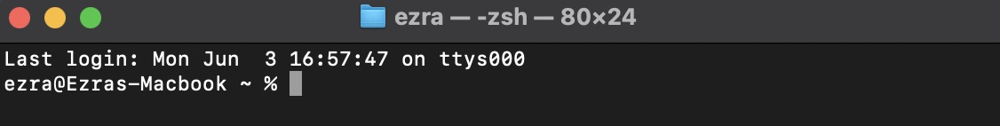
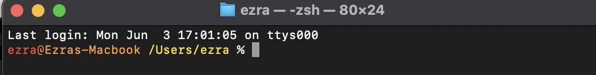
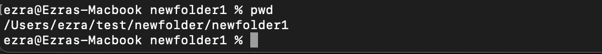
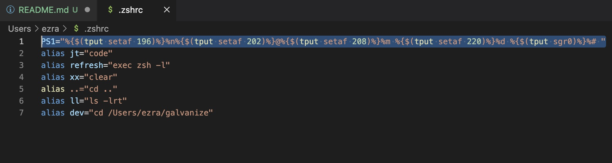
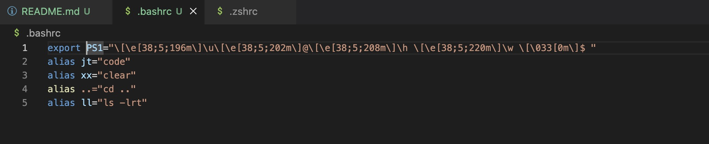

This is a guide for editing your prompt on bash and zsh along with some useful links for generating your prompt.

# Table of Contents

1. What is a prompt?
1. Changing zsh prompt
1. Changing bash prompt

# What is a prompt?

## Default macOS/zsh prompt examples:

The prompt is the text you see on each new line in the terminal in this example the prompt is ``ezra@Ezras-Macbook ~ % ``

## Custom macOS/zsh prompt examples:

In this example the prompt is essentially the same but you'll notice instead of using ``~`` to represent the home directory it displays the full path additionally you'll notice that it is color coded.

## Comparision with long filepath

### Default prompt

### Custom prompt

# Changing zsh prompt

1. Create a backup of current .zshrc (if one exists) ``cp ~/.zshrc ~/.zshrc.backup`` if one does not exists run ``touch ~/.zshrc``
1. Open your .zshrc with your favorite text editor or run ``code ~/.zshrc`` to open it in VSCode (most likely it will be blank if you did not already have one) 
1. Create a new line at the bottom and paste in your generated prompt command from https://zsh-prompt-generator.site or https://robotmoon.com/zsh-prompt-generator
1. After you have pasted the line in save the file close your terminal and reopen it or run ``zsh`` to safely start a new instance. If it worked you should see your new prompt.

Note: Depending on your operating system you may need to change the result from the generator you may need to use ``export PS1=""``, ``PS1=""``, ``export PROMPT=""``, or ``PROMPT=""`` typically any one of these combinations will work. You can also test your new prompt before saving it by opening a terminal and pasting your prompt for example try running this to see the current prompt I use (without the coloring) in the screenshots ``PS1="%n@%m %d %# "`` if it works then you know you are safe to save it to your .zshrc if it does not work try changing "PS1=" to "PROMPT=" like this ``PROMPT="%n@%m %d %# "`` a list of all the variables and definitions can be found on the robotmoon link in this example ``PROMPT="%n@%m %d %# "`` %n is username, %m is hostname, %d is the full path instead of the current folder, and %# tells you if you are running commands elevated by displaying a % (standard) or a # (elevated aka root)

Here is an example of what your .zshrc may look like most likely yours will just have your prompt line and that is okay

If you like the coloring of mine and want to use it feel free ``PS1="%{$(tput setaf 196)%}%n%{$(tput setaf 202)%}@%{$(tput setaf 208)%}%m %{$(tput setaf 220)%}%d %{$(tput sgr0)%}%# "``

# Changing bash prompt

Changing your .bashrc is essentially the same as changing your .zshrc but with a different file name and the variables used are different

1. Create a backup of current .bashrc (if one exists) ``cp ~/.bashrc ~/.bashrc.backup`` if one does not exists run ``touch ~/.bashrc``
1. Open your .bashrc with your favorite text editor or run ``code ~/.bashrc`` to open it in VSCode (most likely it will be blank if you did not already have one) 
1. Create a new line at the bottom and paste in your generated prompt command from https://bash-prompt-generator.org or https://robotmoon.com/bash-prompt-generator/
1. After you have pasted the line in save the file close your terminal and reopen it or run ``bash`` to safely start a new instance. If it worked you should see your new prompt.

Note: Depending on your OS you may need to change the beggining of your prompt to start with ``export PS1=""`` instead of ``PS1=`` in same cases you may need to use ``PROMPT_COMMAND=""``. You can also test your new prompt before saving it by opening a terminal and pasting your prompt for example try running this ``PS1="\u@\h $PWD $ "`` to see the default prompt but with the full path (/data/home/user/folder1/folder2/folder3) or this ``PS1="\u@\h \w $ "`` if you want the full path but abbrevated at the home directory (~/folder/folder1/folder2)

Here is an example of what your .bashrc may look like most likely yours will just have your prompt line and that is okay

If you like the coloring of mine and want to use it feel free ``PS1="\[\e[38;5;196m\]\u\[\e[38;5;202m\]@\[\e[38;5;208m\]\h \[\e[38;5;220m\]\w \[\033[0m\]$ "``